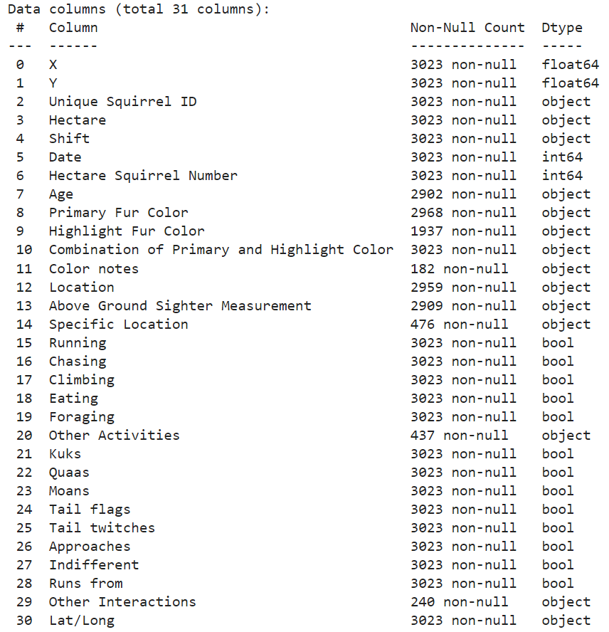
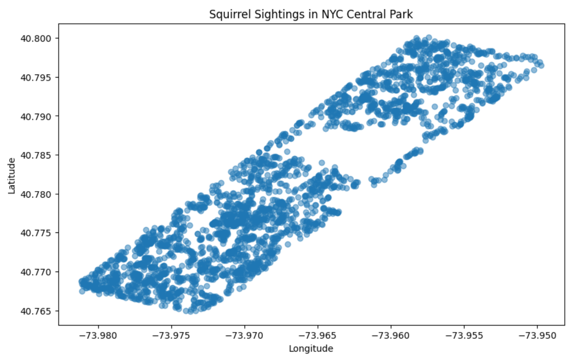

# NYC Squirrel Census Analysis 

Feel free to reach out if you have any questions or suggestions!

- **Email**: [barancndogan@gmail.com](mailto:barancndogan@gmail.com)
- **LinkedIn**: [Baran Can Dogan](https://www.linkedin.com/in/barancandogan/)

This project provides a comprehensive analysis of the 2018 Central Park Squirrel Census data. It offers valuable insights and visualizations about squirrel sightings in New York City's Central Park, utilizing advanced data processing and geospatial visualization techniques. It provides an interactive data visualization of the 2018 Central Park Squirrel Census. Using Python libraries such as Pandas, Matplotlib, and Folium, the project visualizes squirrel sightings, behaviors, and fur colors on an interactive map of NYC’s Central Park.

The Squirrel Census (https://www.thesquirrelcensus.com/) is a multimedia science, design, and storytelling project focusing on the Eastern gray (Sciurus carolinensis). They count squirrels and present their findings to the public. This table contains squirrel data for each of the 3,023 sightings, including location coordinates, age, primary and secondary fur color, elevation, activities, communications, and interactions between squirrels and with humans.

## 🚀 **Features**

- 📍 **Interactive Squirrel Maps**: View squirrel sightings across Central Park using markers, clusters, and heatmaps.
- 🎨 **Fur Color Mapping**: Visualize squirrel sightings based on primary fur colors (Gray, Black, Cinnamon).
- 🍽️ **Eating Behavior Tracking**: Identify squirrels based on whether they were eating or not.
- 📊 **Squirrel Statistics**: View statistical summaries of squirrel sightings and behaviors.
- 🔥 **Heatmap**: Toggle a heatmap view to see squirrel concentration across the park.

## 🛠️ **Lybraries Used**

- **Pandas**: For data cleaning and analysis
- **Matplotlib**: For plotting squirrel sightings
- **Folium**: For generating interactive maps
  
## 📁 **Dataset**

The project uses the[ **2018 Central Park Squirrel Census** dataset](https://data.cityofnewyork.us/Environment/2018-Central-Park-Squirrel-Census-Squirrel-Data/vfnx-vebw). The dataset provides detailed information on squirrel sightings, including geographic locations, behaviors, and fur colors.

The image below shows a detailed view of the NYC Squirrel Census dataset, which comprises 31 columns. Each column captures various attributes or behavioral aspects of squirrels observed in Central Park, New York City.

# Squirrel Sightings in NYC Central Park

This scatter plot shows squirrel sightings in NYC Central Park. Each blue dot on the graph represents the geographic coordinates (latitude and longitude) of a squirrel sighting recorded in the park. The plot is designed to visualize the spatial distribution of these sightings, allowing us to see where squirrels are commonly found within the park.

## Purpose of the Plot

### Geographic Distribution
The main reason for creating this plot is to show how squirrel sightings are spread across Central Park. It helps to identify areas of high activity or areas where sightings are less frequent.
The plot aids in understanding the behavior and movement of squirrels within the park. For example, areas with a dense cluster of dots indicate places where squirrels are more likely to be found.

